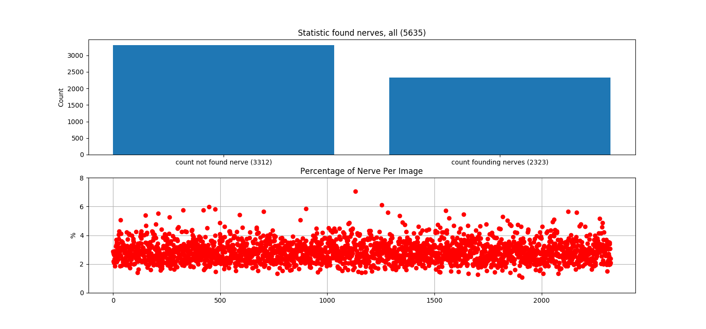
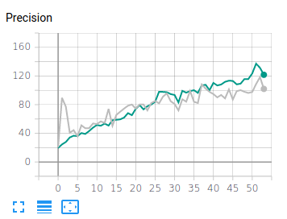
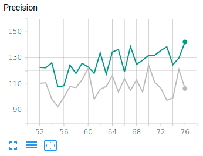

# cvl-internship-2020-lazaryan

## Task

Even the bravest patient cringes at the mention of a surgical procedure. Surgery inevitably brings discomfort, and oftentimes involves significant post-surgical pain. Currently, patient pain is frequently managed through the use of narcotics that bring a bevy of unwanted side effects.

This competition's sponsor is working to improve pain management through the use of indwelling catheters that block or mitigate pain at the source. Pain management catheters reduce dependence on narcotics and speed up patient recovery.

Accurately identifying nerve structures in ultrasound images is a critical step in effectively inserting a patient’s pain management catheter. In this competition, Kagglers are challenged to build a model that can identify nerve structures in a dataset of ultrasound images of the neck. Doing so would improve catheter placement and contribute to a more pain free future. 

## Getting started

Install dependencies by running the `install.sh` from the repository's root.

To demonstrate the operation of the network, run a demo:
```shell script
python3 demo/demo_app.py --model_path PATH_TO_TRAINING_MODEL --dir_images PATH_TO_IMAGES
```

## Data analysis

The original dataset contains 3 channel GrayScale sound images of the cervical joint. Image size - **420 x 580**.

The size of the source data set: **5635 images** and 5635 masks for the source images.

The source data contains 2 types of images:
- with a nerve (2323 images)
- without nerve (3312 images)

Statistics on the source data:



## NN архитектура

`U-NET` with resnet34 as a backbone.

## Training process

The resulted model was trained on the notebook with the following hardware:

```
    GPU: NVIDIA GeForce 1050-Ti
    CPU: Intel Core i7-8750H
    RAM: 16GB DDR4
    Storage: HHD
```

The training process was developed on the PyTorch. The training script contains here: train/train_pytorch.py.

The training process features:


0 - 50 epochs


52 - 76 epochs

# Result

- count images: 4059
- found nerve: 94.70238095238095
- detect lack of nerve: 54.644808743169406
- loss: 30.10593742301059
- scope: 69.8940625769894

